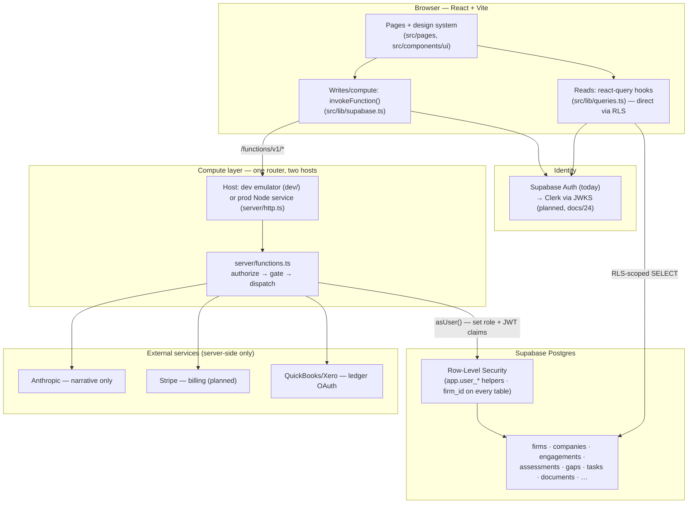
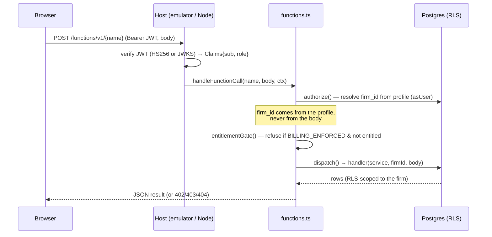
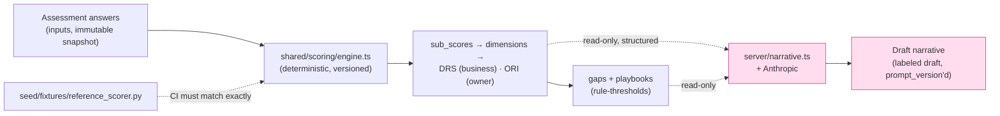
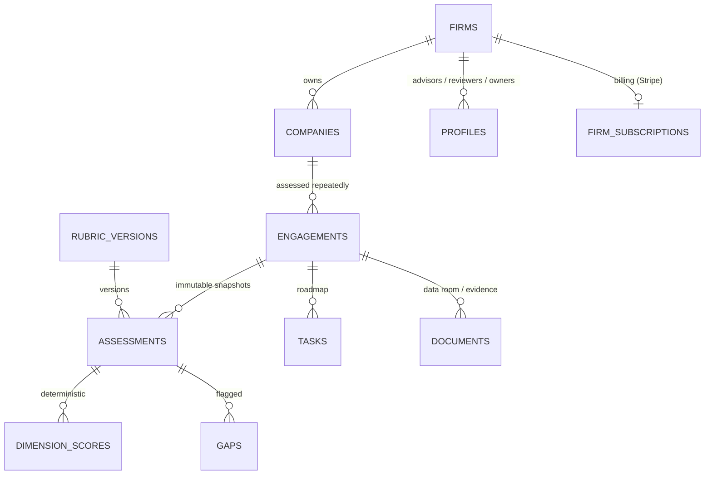
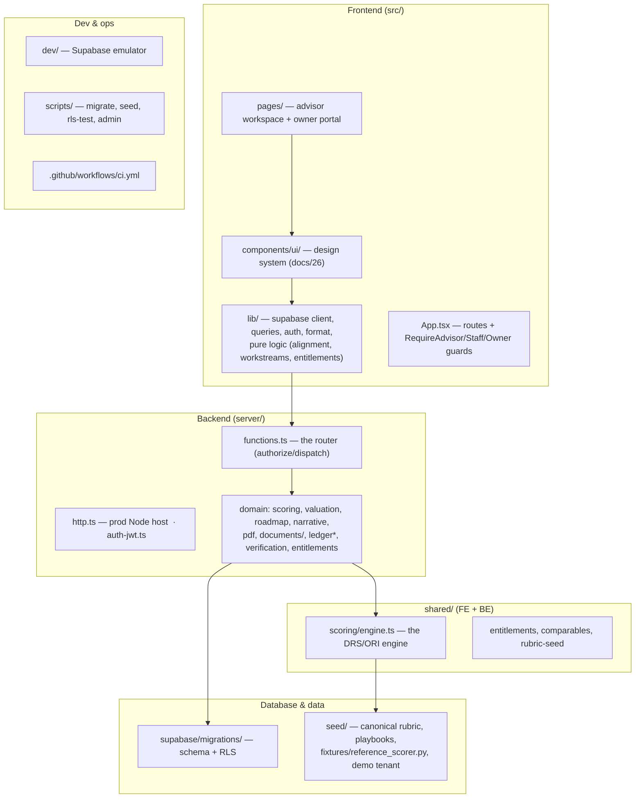

# Architecture map — the whole system at a glance

A visual companion to `docs/01-architecture.md` (prose) and the non-negotiable
rules in CLAUDE.md. Diagrams render on GitHub. Start here to understand how the
pieces fit; then use `docs/27-engineering-patterns.md` to add to them.

---

## 1. System layers

The frontend never talks to Postgres directly for writes — it goes through the
**compute layer**, which is the *same router code* whether it runs as the dev
emulator or the production Node service. Identity comes from Supabase Auth today
(Clerk is planned, `docs/24`); every table is isolated by **Row-Level Security**.

---

## 2. A compute request, end to end

Every `/functions/v1/<name>` call is **authorized before it runs**: the caller's
firm is resolved from their profile (never trusted from the request body), the
billing gate can refuse paid actions, then the handler executes under RLS.

---

## 3. The load-bearing rule: deterministic scoring, AI is narrative-only

The DRS/ORI scores are produced by **versioned, rule-based code** that must
reproduce the Python reference fixtures exactly. The Claude API only writes prose
*from* those numbers — it never computes or edits a score.

*Dashed line into narrative = one-way: data flows to the LLM, never back to a
scoring table (rule 2).*

---

## 4. Data & tenancy model (the spine)

`firm_id` is on **every** domain table; RLS scopes all reads/writes to the
caller's firm. Assessments are **immutable snapshots** tied to a `rubric_version`
— re-assessing creates a new one, never edits the old (rule 4).

---

## 5. Repo module map — where things live

---

## Where to go next
- **Add a feature** → `docs/27-engineering-patterns.md` + `templates/`.
- **UI** → `docs/26-ui-system.md`.
- **Data model detail** → `docs/02-data-model.md`. **Scoring** → `docs/03` / `docs/07`.
- **Path to production** (Clerk, Stripe, ops) → `docs/24` / `docs/25` / `docs/10`.
