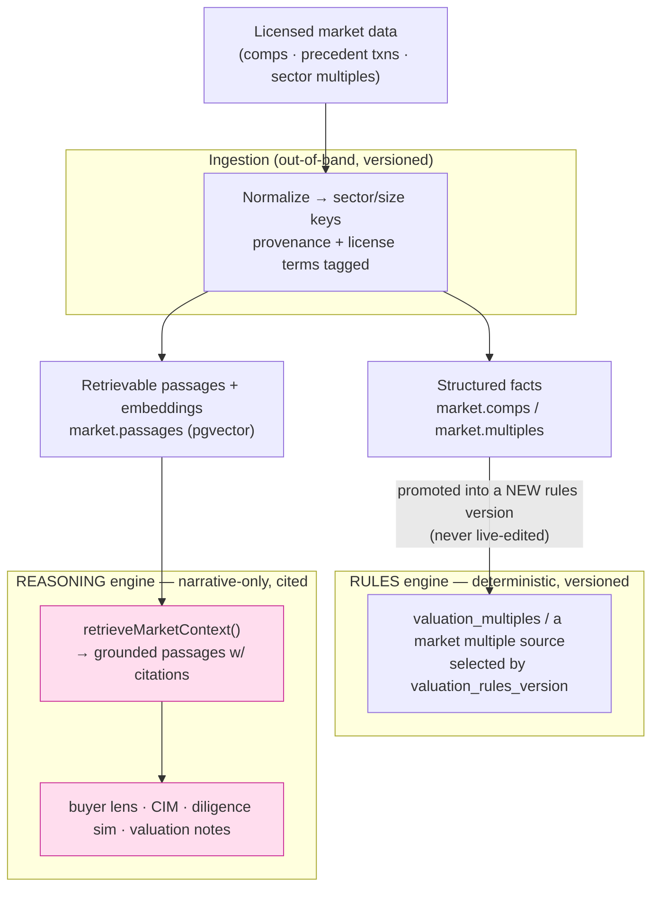

# 01 — Market-intelligence RAG (paid third-party data)

**Status:** Partially built. Design record + as-built notes.

> **As-built (2026-07).** The **deterministic multiple lane** (a versioned
> `'market'` source in `selectValuationMultiple`, seeded from a clearly-labeled
> placeholder dataset, reference-only) and the **retrieval lane** (`market.passages`
> + `retrieveMarketContext` + the `retrieve-market-context` registry function)
> both shipped, plus the **`citationPostCheck`** source-score guard and the UI
> panels (Valuation "Market comparables", Buyer Lens "Market context").
> **One deviation from the design below:** the retrieval lane uses Postgres
> **structured + full-text** search (`tsvector`/GIN/`ts_rank`), *not* pgvector —
> CI and the target Postgres run stock `postgres:16` with no `vector` extension.
> Semantic embeddings (`market.passages.embedding`, vector search) are the
> documented follow-on for when pgvector is provisioned; the schema and the
> `retrieveMarketContext` API are shaped so adding the embedding column and an
> ANN rank is additive. Still open: injecting cited market context into a
> *generated* deliverable (Bench-gated), and swapping the placeholder dataset for
> a licensed one after counsel review (§ IP & licensing, docs/41 §8).

## The idea, and why it's worth doing

Today every number in the product comes from one of two places: the client's
own inputs (self-reported, then document-/ledger-verified) or the firm's own
book (`ownBookMultiple`, `deal_outcomes`). That is deliberately conservative
and it is a real moat (docs/09). But it leaves the biggest question an owner
asks — *"what is a business like mine actually worth in today's market?"* —
answered only from a static, seeded multiple table (`valuation_multiples`) and
the firm's own handful of closed deals.

Harvey's lesson is that **grounding beats cleverness for trust**: a legal
answer is only useful if it cites authority the reader can verify. The
sell-side analog is licensed market data — precedent transactions, comparable
public companies, sector multiple benchmarks, deal-volume trends. A *simple*
RAG layer over paid data would let the valuation and every market-facing
deliverable say "comparable transactions in your sector closed at 5.2–6.1×
LTM EBITDA in the last 18 months (source: [dataset], n=14)" instead of
leaning on a seed constant. That is a step-change in perceived and actual
value, and — done right — it *strengthens* the moats rather than diluting
them, because licensed data is the **cold-start** the proprietary corpus
(docs/09 moat 2) eventually surpasses.

## The one hard constraint that shapes the whole design

Licensed market data is powerful *and* dangerous to the architecture, because
it is tempting to let an LLM read a pile of comps and "estimate a multiple."
That would violate rule #1 (no LLM computes or influences a score/valuation)
and rule #2 (AI is narrative-only). So the design splits paid data into **two
lanes that never cross**, matching the six-engine model (docs/28 §6):



- **Rules lane (deterministic).** Structured licensed facts (a sector's
  median multiple, a size-band spread) can *inform the valuation multiple* —
  but only the same way `ownBookMultiple` already does: by being promoted into
  a **new `valuation_rules_version`**, never by editing a number live and
  never through an LLM. `server/valuation.ts` already has the exact seam:
  `multiple_source: 'table' | 'override' | 'own_book'` becomes
  `… | 'market'`, and `selectValuationMultiple` (`shared/own-book.ts`) gains a
  market candidate under a config flag (`config.market_multiples.enabled`),
  disabled by default. No handler math changes; a new source is one more
  branch behind a versioned config.

- **Reasoning lane (narrative, cited).** Retrieval-grounded market context
  feeds the *narrative* documents (buyer lens, CIM, diligence simulation,
  valuation commentary). Here the model may *quote* a retrieved figure — but
  only if it was actually retrieved and it carries a citation. This is where
  RAG proper lives, and it reuses the numeral-firewall discipline (below).

The two lanes share an ingestion pipeline and a source-of-truth store; they
never share a code path into an output. That separation *is* the architecture.

## Data model

A new **non-tenant reference schema** — `market` — parallel to how `analytics`
is a service-role-only cross-firm schema (`server/financial-corpus.ts`).
Licensed market data is *global reference data*, not any firm's data, so it
must **not** carry `firm_id` and must **not** sit under the firm-scoped RLS
template (rule #5 is about firm isolation of *tenant* data; reference data is
the explicit non-tenant case). Access is read-only for `authenticated`,
subject to the license-exposure rules below.

```
market.datasets          -- one row per licensed source + license terms + version
market.multiples         -- sector_key × size_band → {median, p25, p75, n, as_of}
market.comps             -- precedent transactions / comparable companies (structured)
market.passages          -- retrievable text chunks + embedding (pgvector) + citation
```

Key columns everywhere: `dataset_id`, `as_of` (data currency), and a
`citation` (human-readable source + URL/identifier the UI renders). `market`
reuses the existing pgvector dependency already in the stack (LanceDB is not
needed at this scale; `pgvector` in Supabase Postgres is sufficient and keeps
the "boring, one database" posture).

**Sector/size key mapping.** The valuation engine already has
`industryKeyFor()` and a `size_band` derivation (`server/valuation.ts`).
Licensed data must be normalized to the *same* key-space at ingestion, so a
market multiple lines up with the table multiple and the own-book multiple.
This mapping is the one genuinely fiddly part and belongs in a pure,
unit-tested module (`shared/market-keys.ts`, mirroring `shared/own-book.ts`).

## Retrieval (the RAG proper)

One server function, `retrieve-market-context`, in the **knowledge** engine
(`server/registry.ts`), scope `engagement`:

```
retrieveMarketContext(db, { engagementId, kind })
  → { passages: [{ text, citation, dataset, as_of }], structured: {...} }
```

- It resolves the engagement's sector/size keys (already authorized on the
  engagement), embeds a templated query (`"precedent transactions,
  {sector}, {size_band}, last 24 months"`), does a vector search over
  `market.passages` filtered to fresh, in-license datasets, and returns the
  top-k passages **each with its citation**, plus any exactly-matching
  structured rows.
- It is **read-only and deterministic in its plumbing** — the model is not in
  the retrieval loop; retrieval is a SQL/vector query. This mirrors how
  `buildInstitutionalReviewPayload` assembles a read-only picture that the
  model then narrates.

Retrieved context becomes an *input* to the existing narrative payloads
(`buildCimPayload`, the diligence `ReviewPayload`, a new valuation-commentary
payload), exactly like `top_gaps` or `dimensions` are today.

## The citation contract (extending the numeral firewall)

`numeralPostCheck` (`server/narrative.ts`) today whitelists a numeral only if
it appears in the payload JSON. That rule extends *for free*: because
retrieved figures are placed **into the payload** (as `market_context`), a
model quoting "5.2×" passes the firewall **only if 5.2 was actually
retrieved**. A hallucinated multiple still fails and regenerates, then hard-
fails — the existing guarantee, now covering market claims.

On top of that, market-facing documents get one added check — a **source
contract**: any sentence that states a market figure must carry the citation
token for the passage it came from. Concretely, `market.passages` rows carry a
short `cite_id`; the payload includes `{ value, cite_id, citation }`; a
`citationPostCheck` verifies every market numeral in the output is adjacent to
a rendered citation. This is the "source score" made executable at generation
time, and it is what lets an advisor put the number in front of a buyer.

## Where it surfaces (UI already exists)

No new pages needed — every consumer is a live surface:

| Surface | What market data adds |
|---|---|
| **Valuation** (`src/pages/ValuationPage.tsx`) | A `market` multiple shown alongside table + own-book, same pattern as the own-book panel today; drives the number only when a `valuation_rules_version` elects it |
| **Buyer lens / Diligence simulation** (`BuyerLensPage.tsx`) | "A sophisticated buyer will benchmark you against these comps" — grounded, cited market context in the blind-spot narrative |
| **CIM / Teaser / Mgmt presentation** (Deliverables studio) | Market-context paragraphs ("sector tailwinds", "precedent transactions") — cited, draft-labeled, strengths-only |
| **Comparables** (`server/comparables.ts`) | Licensed comps complement the firm's own-book siblings |

## Licensing, freshness, cost

These are first-class, not afterthoughts — a paid dataset has terms:

- **Exposure limits.** `market.datasets` records what the license permits
  (e.g. aggregate stats only vs. row-level display). The retrieval function
  filters on it; a dataset licensed for internal aggregate use only never
  returns a displayable row-level passage. Encode the terms; don't rely on
  reviewer memory (the same posture as `server/financial-corpus.ts`'s
  "counts/distributions only" note).
- **Freshness.** `as_of` gates staleness; retrieval excludes data past a
  configurable horizon so a report never cites a two-year-old multiple as
  current.
- **Cost & caching.** Ingestion is out-of-band (scheduled, `server/scheduled.ts`
  or a script), not per-request; retrieval hits local Postgres/pgvector, so
  per-report cost is a vector query, not a vendor API call. Embedding cost is
  paid once at ingest. This keeps the paid-API spend bounded and predictable.

## IP & licensing — the two-lane split is also a risk gradient

External data is the highest *legal* risk in this proposal, and the counsel
agenda already anticipates it: **`docs/41-legal-counsel-talking-points.md` §8**
("third-party / external paid data") covers permitted-use scope, derivative
ownership, AI/ML-training clauses, survivability/purge, and the scraped-data
caveat. That section was written for the *deterministic* "blend purchased comps
into our multiples" use. RAG adds one thing §8 doesn't fully cover: it **stores
and can reproduce text**, not just consume facts. The IP picture breaks into
three layers, in order of what actually binds us:

1. **The license contract (dominates).** For commercial M&A data (Capital IQ,
   PitchBook, BVR/DealStats, Refinitiv, …) the agreement is usually *stricter*
   than copyright defaults. The clauses that bite RAG specifically:
   **internal-use vs. third-party display** (surfacing a comp to an owner or
   buyer in a CIM/teaser is display, often a different tier or prohibited — and
   we distribute *through advisors to their clients*); **no redistribution / no
   derived benchmark** (the direction the moats point, docs/09 §7);
   **"no AI ingestion"** (our scoring is deterministic and safe, but RAG puts
   licensed text into an LLM context window — some clauses are worded broadly
   enough to catch that); and **termination/purge** (must we delete the data
   *and its embeddings/derivatives* if the license ends?).
2. **Copyright & database rights (the floor).** This is where the two lanes
   diverge sharply: **facts aren't copyrightable** (US: *Feist* — a median
   multiple, `n=14` is a fact), while **verbatim expression is** (an analyst's
   deal write-up). Plus the **EU/UK sui-generis database right** if we source EU
   data.
3. **Scraping** — don't. §8 flags CFAA / source-ToS / database-right exposure.
   License, don't scrape.

**The key insight: the rule-1 lane split *is* the IP-risk gradient.**

| Lane | Consumes | IP exposure |
|---|---|---|
| **Rules lane** — `'market'` multiple → a versioned `valuation_rules_version` | Facts (a number), *Feist*-unprotectable | **Low.** Contract terms still apply, but no copyrightable expression is stored or reproduced. |
| **Reasoning lane** — retrieved passages → narrative | Text — copyrightable, display-gated | **High.** Verbatim reproduction, "AI-ingestion" clauses, and third-party-display terms all bite here. |

So the architecture that keeps scoring deterministic (rule #1) *also* minimizes
IP exposure — the risky copyrightable material stays in the retrieval lane,
where we constrain it. Design consequences, several of which the sections above
already encode:

- **Buy facts, feed the deterministic lane; keep the RAG lane to short, cited,
  *summarized* snippets.** A generated sentence that states a fact and cites the
  source is far safer than one that pastes a licensed paragraph. Prefer
  "summarize, don't reproduce"; cap verbatim length.
- **`market.datasets` encodes license terms as *enforced flags*, not reviewer
  memory** — `display_scope` (aggregate-only vs. row-level vs. third-party
  display), `ai_ingestion_allowed`, `derivative_rights`, `purge_on_termination`.
  The retrieval function filters on them, so a dataset licensed internal-only
  can never return a displayable passage. Same posture as
  `server/financial-corpus.ts`'s "counts/distributions only" note.
- **The citation contract cuts both ways** — it satisfies attribution
  requirements *and* means we render source-identified snippets, so pair it with
  the verbatim-length cap.
- **License-review-before-ingest is a hard gate.** No dataset loads until
  counsel maps its terms to how both lanes will use it (docs/41 §8; §14 lists it
  as a go-live fast-follow). Encode the resulting terms in `market.datasets`.
- **Keep licensed data out of the proprietary corpus** — the non-tenant
  `market` schema stays separate from own-book/calibration so restricted inputs
  never taint moat ownership (docs/41 §5, §8).

None of this is legal advice — counsel owns §8's calls — but the architecture
can make compliance *structural* rather than a matter of trust. Keep this
subsection and `docs/41 §8` in sync when either changes.

## How this strengthens the moats (not dilutes them)

Licensed data is buyable by any competitor, so it is **not** itself a moat —
which is exactly why it's safe to lean on. It is the *cold start* that makes
the product valuable on day one, while the proprietary layer (own-book
multiples, `deal_outcomes` calibration, the engagement graph — docs/09)
accretes underneath. The end state: the valuation blends **licensed market
(broad, bought) + own-book (narrow, proprietary) + calibration (predictive,
proprietary)**, and over time the proprietary signals earn more weight. The
architecture already supports this — `selectValuationMultiple` is the blend
point, and it's versioned.

## Build order (thin first)

1. **Structured multiples only, deterministic lane.** `market.datasets` +
   `market.multiples`, the `industryKeyFor`/size-band normalization, and a
   `'market'` branch in `selectValuationMultiple` behind a disabled-by-default
   `valuation_rules_version` config. No RAG, no LLM. Lowest risk, immediate
   valuation credibility. Ships with a fixture test (rule #1: reproduce
   fixtures exactly).
2. **Retrieval + citation contract.** `market.passages` (pgvector),
   `retrieve-market-context`, and the `citationPostCheck` extension. Wire it
   into the diligence-simulation payload first (that surface is already
   draft-labeled and advisor-reviewed).
3. **Broaden consumers.** CIM/teaser market-context paragraphs; comps view.
4. **License/freshness governance** hardened before any paid dataset with
   row-level display terms is loaded.

## Definition of done (per slice)

`npm run build`, `npm test` (valuation fixtures still exact), `npm run test:rls`
(the `market` schema is non-tenant and readable, tenant tables unchanged),
`npm run eval` (see doc 02 — market claims must pass the citation contract),
and a `docs/06-decisions.md` line. A new `valuation_rules_version` or dataset
version is the unit of change — never an in-place edit (rule #6).
