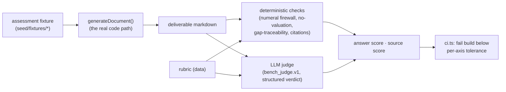

# 02 — ExitBlueprint Bench (evaluation rubric)

**Status:** Strategy / architecture proposal. Not built. Design record only.

## Why this is the highest-leverage writeup

Harvey's most transferable idea isn't a model or a workflow — it's that they
made AI work-product quality **measurable**. [BigLaw Bench](https://www.harvey.ai/blog/introducing-biglaw-bench)
grades a deliverable on two *independent* axes:

- **Answer score** — "what % of a lawyer-quality work product did the model
  complete?" Positive points for required content, **negative points for
  hallucinations** (a human has to spend effort undoing them), divided by the
  total available positive points.
- **Source score** — for every point that needs a citation, did the model
  provide a *verifiable* one? A model can be confidently right (high answer)
  and untraceable (low source) — and that gap is worth measuring on its own.

Right now this repo has *guardrails* on narrative (the numeral firewall, the
draft banner, the deterministic composer fallback) and an *extraction* eval
(`server/llm/evals/`, `npm run eval`, tolerance 0.95). What it does **not**
have is a measure of whether a generated **deliverable** — an owner report, a
CIM, a diligence simulation — is actually advisor-quality. Today a prompt
change is validated by "3 fixtures reviewed by Matthew" (docs/04). That is a
golden-set eyeball, not a rubric. This writeup turns it into one.

## What we already have to build on

`server/llm/evals/runner.ts` is the right skeleton, and it generalizes cleanly:

- A **golden case** = an input fixture + an expected output, scored by a pure
  function, aggregated, failing CI below a tolerance (`ci.ts`).
- Today the input is a document and the score is extraction accuracy. The same
  shape holds if the input is an **assessment fixture** and the score is a
  **rubric grade of the generated deliverable**.

So ExitBlueprint Bench is not a new system — it's a second grader plugged into
the existing harness, using the fixtures that already exist
(`seed/fixtures/*`, the reference-scorer fixtures, `fixtures/sellside/`).

## The rubric model

A bench case is: *(assessment fixture, doc_type, rubric)*. The rubric is a
list of **criteria**, each with a sign and a weight — authored by an M&A
practitioner (the "domain-expert-in-the-loop" — here, Matthew or a partner
advisor), stored as data (rule #3 spirit: methodology in data, not code).

```
bench_case:
  fixture: "field-services-baseline"     # an existing scored assessment fixture
  doc_type: "owner_report"
  rubric:
    answer:
      - { id: "names-top-gap",     weight: 3, kind: positive,
          check: "states the highest-severity gap by name" }
      - { id: "explains-why-buyer-cares", weight: 2, kind: positive, ... }
      - { id: "no-valuation-in-owner-report", weight: 4, kind: negative,
          check: "must NOT state a dollar valuation or multiple" }
      - { id: "hallucinated-number", weight: 5, kind: negative,
          check: "any numeral not in the payload" }
    source:
      - { id: "gap-traceable", requires_citation: true,
          check: "each named gap traces to a fired gap in the explain trace" }
```

**Answer score** = (Σ positive points earned − Σ negative points incurred) ÷
Σ positive points available. **Source score** = (# citation-required points
satisfied) ÷ (# citation-required points). The two are reported and thresholded
**separately**, exactly as Harvey does — a report can be complete but
untraceable, and we want that to show.

## Two graders, and why the split matters

Each criterion is checked by one of two graders:

1. **Deterministic checks (free, exact, always run).** A large fraction of
   what matters is machine-checkable and should never cost an LLM call:
   - the **numeral firewall** already *is* the "no hallucinated number"
     negative criterion — reuse `numeralPostCheck` verbatim;
   - "owner report contains no valuation" is a regex/keyword check (the CIM
     already enforces "strengths-only, no valuation" server-side — the bench
     asserts it on the *output*);
   - "each named gap exists in the explain trace" is a set-membership check
     against `explainAssessment` output;
   - the **citation contract** from doc 01 is a source-score check.

   These are pure functions over (output, payload, explain-trace) and belong
   next to the composers in `server/llm/evals/`. They give a real, if partial,
   score with zero variance and zero API cost.

2. **LLM-as-judge (for the subjective criteria).** "Explains why a buyer cares
   in plain language" is not regex-checkable. Here a **separate** Claude call
   grades the output against the criterion — the classic LLM-judge pattern.
   Guardrails, so the judge is trustworthy:
   - The judge is a *different concern* from generation and lives behind its
     own `prompt_version` (`bench_judge.v1`), so it's versioned like everything
     else (rule #6).
   - The judge returns a structured verdict (pass/fail + one-line rationale)
     per criterion, never a free-form score — variance is the enemy of a
     regression gate.
   - **Anchor the judge with the golden set.** Matthew's hand-graded fixtures
     become the judge's calibration: if the judge disagrees with a human grade
     on an anchor case, the judge prompt is wrong, not the output. This keeps
     the "domain expert in the loop" as the ground truth, with the LLM judge as
     a scaling layer — the same division Harvey uses (expert rubrics, automated
     grading).

## Where it plugs in



- **Runner:** extend `server/llm/evals/runner.ts` with a `BenchCase` type and
  a `scoreDeliverable(case)` alongside `scoreCase`. It calls the *real*
  `generateDocument` so the bench grades the shipping path, not a mock.
- **CI:** `ci.ts` already fails below a tolerance; add per-axis thresholds
  (answer ≥ X, source ≥ Y). Because the deterministic checks are free and
  exact, they can gate CI on every run; the LLM-judge tier can run on a
  labeled `[eval]` job (like the AI-touch clause in the definition of done)
  to bound cost.
- **Fixtures:** reuse existing scored assessments; add a `rubric.json` per
  (fixture, doc_type). Authoring rubrics is the domain-expert work, and it's
  where the methodology actually lives.

## What this unlocks

- **Prompt changes become safe.** Today a `prompt_version` bump is validated by
  eyeball (docs/04). With the bench, a regression in owner-report quality fails
  CI, and an improvement is *quantified*, per axis, per doc_type.
- **Market-data claims get policed.** Doc 01's citation contract is a
  source-score criterion — the bench is where "every market figure is cited"
  is enforced as a number, not a hope.
- **It's the honest version of the moat story.** docs/20 positions the product
  as an intelligence layer; a measured deliverable-quality score is the
  evidence for that claim, and the substrate for saying "our reports improved
  N% at version X."

## Non-goals / guardrails

- The bench grades **narrative** deliverables. It never grades — or touches —
  the DRS/ORI score; those are covered by the exact-reproduction fixture test
  (`npm test`, rule #1). Keep the two eval systems separate: `npm test` proves
  the *numbers* are right; `npm run eval` proves the *prose* is good.
- The LLM judge is **advisory to CI**, anchored to human golden grades; it
  never silently becomes the source of truth. If the judge and a human anchor
  diverge, that's a judge-prompt bug to fix, logged in `docs/06-decisions.md`.

## Definition of done (first slice)

A `BenchCase` type, one rubric on the existing owner-report fixture, the
deterministic-check grader (reusing `numeralPostCheck`), per-axis thresholds in
`ci.ts`, `npm run eval` green, and a `docs/06-decisions.md` line. The LLM-judge
tier is a fast follow, gated behind the `[eval]` job.
