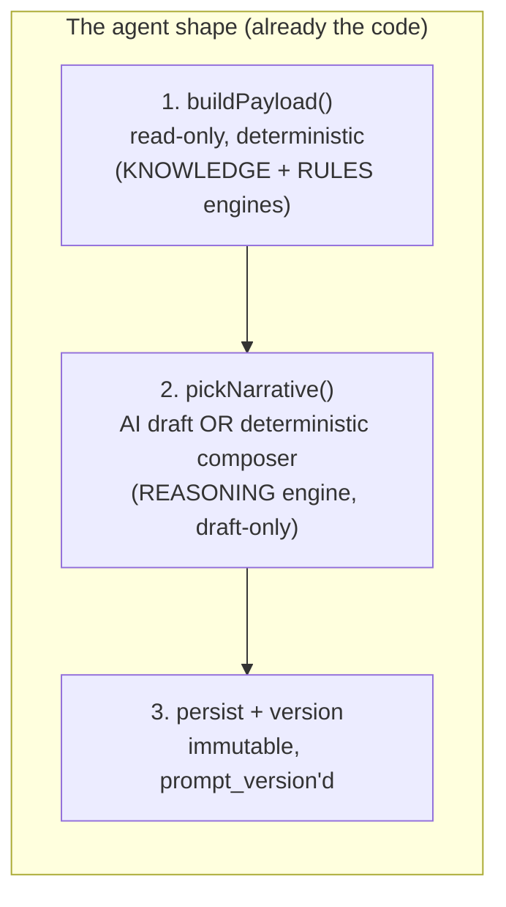

# 03 — Sell-side workflow agents (Agent Builder analog)

**Status:** Strategy / architecture proposal. Not built. Design record only.

## The idea

Harvey's product isn't a chat box; it's 500+ **agents** — pre-built,
use-case-specific chains of "assemble structured inputs → run a tuned step →
produce a work product" — plus **Agent Builder**, which lets each firm tailor
those agents to *its* process without engineering. Their positioning is "built
by lawyers, tailored by you."

For a product **distributed through M&A advisors**, the "tailored by you" half
is strategically load-bearing: firms want the remediation playbooks, the buyer
lens, and the report narratives to reflect *their* house methodology, not
ours. That's the white-label surface the advisor channel actually wants.

The good news: this repo already has several agents — they just aren't named
as a category yet.

## We already have agents (three of them)

Look at `server/diligence-simulation.ts` through Harvey's lens and it is
exactly an agent:

1. **Assemble a read-only, deterministic picture** — `buildInstitutionalReviewPayload`
   pulls scores, gaps, evidence posture, fired buyer-lens items.
2. **Compute the work product deterministically** — `assembleDiligenceFindings`
   / `rankFindings` produce severity-keyed, remediation-pointed findings (pure
   functions, never the model — rule #1).
3. **Have the model narrate it, cited and labeled** — the AI frames the
   findings; `numeralPostCheck` guards it; `DRAFT_BANNER` labels it;
   `prompt_version` versions it; the run persists as an immutable snapshot.

The owner report, delta report, CIM, teaser, and management presentation
(`server/narrative.ts`) are the *same* three-step shape: **build payload → pick
narrative (AI or deterministic composer) → persist versioned draft**. They
already share `pickNarrative` and `persistGeneratedDocument`. That shared shape
*is* the agent runtime — it's just implicit.



## What "generalize into a workflow surface" means

Two moves, both incremental:

### Move 1 — Name the pattern (make the runtime explicit)

Extract the implicit runtime into a small, explicit contract so a new agent is
a **declaration**, not a new copy of the three-step dance. An agent spec:

```
AgentSpec {
  key: "diligence_simulation",         // = prompt_version stem, already the convention
  engine: "reasoning",                 // registry engine tag (docs/28 §6)
  scope: "assessment",                 // registry auth scope
  buildPayload(db, ctx): Payload,      // the read-only assembler
  compose(payload): string,            // the deterministic composer (fallback + rule-1-safe)
  promptKey: "diligence_simulation.v1",// prompt-registry key (file or DB override)
  guards: [numeralFirewall, citationContract?], // output checks
  persist: "generated_documents" | "diligence_simulation_runs",
}
```

This is deliberately *not* a generic agent framework — it's a typed registry
of the agents we actually have, mirroring how `server/registry.ts` made the
function set declarative. Adding an agent becomes one spec, and every agent
inherits the firewall, the composer fallback, the draft labeling, and
versioning **by construction** — so the CLAUDE.md rules can't be forgotten in a
new deliverable. The six-engine tags stay accurate because each spec declares
its engine.

### Move 2 — Let firms tailor them (the Agent Builder analog)

The firm-tailoring surface **already half-exists**: `server/prompt-registry.ts`
lets a superadmin override a prompt body (`analytics.prompt_templates`) with no
deploy, constrained to the shipped allow-list of keys. Generalize that from
*superadmin-global* to *firm-scoped, bounded* customization:

- **Firm prompt overlays.** A firm may supply an **overlay** on an agent's
  prompt — additional house context, tone, section preferences — layered onto
  (not replacing) the versioned base prompt. Stored firm-scoped under RLS (rule
  #5), tracked as its own version (rule #6). The base prompt's payload↔field
  contract and the numeral firewall are code, independent of prompt text
  (exactly as the registry doc-comment already argues), so an overlay can
  **never** inject invented numbers or break a delivery. That invariant is what
  makes firm-editable prompts safe.
- **Templates / section sets.** docs/17 already flags a "DB-backed,
  firm-editable CIM template" as a follow-up (`shared/cim/template.ts`). That's
  the same idea: the *methodology* (which sections, which evidence mapping)
  lives in firm-editable data, the *engine* stays fixed. Rule #3 in miniature.
- **Plans are the precedent.** docs/37 Plans are already advisor-authored,
  reusable, versioned bundles applied to an engagement as immutable snapshots.
  Workflow-agent tailoring is the same governance model applied to the
  narrative/reasoning agents instead of to remediation tasks.

## What stays fixed (the guardrails firms cannot edit)

The whole point is bounded customization. A firm can change *voice, emphasis,
section set, and house context*. A firm can **never** edit:

- the deterministic engines (scoring, valuation, findings) — rule #1;
- the numeral firewall / citation contract — the anti-hallucination floor;
- the draft labeling and advisor-review gate — rule #2;
- the payload contract (what data the agent may see) — e.g. the CIM's
  strengths-only, no-valuation payload stays strengths-only regardless of
  overlay.

Overlays layer on top of these; they don't replace them. This is "tailored by
you" with the professional-liability floor held by us.

## Surfaces (already built)

Nothing new to draw. The agents run where their output already lives:

| Agent | Surface today |
|---|---|
| Owner / delta report | Deliverables studio (`DeliverablesPage.tsx`) |
| CIM · teaser · mgmt presentation | Deliverables studio |
| Diligence simulation / buyer lens | `BuyerLensPage.tsx` |

The tailoring UI is the one genuinely new surface, and it's small: a firm-admin
panel (the Organization page already hosts firm-admin controls, docs/02) to
manage prompt overlays and template section sets, with a **preview-against-a-
fixture** button that runs the agent through the doc-02 bench so a firm sees
both the output *and* its answer/source score before saving. Ship the runtime
(Move 1) first; the tailoring UI (Move 2) follows once there's firm demand —
consistent with "don't scaffold ahead."

## Build order

1. **Extract the `AgentSpec` runtime** from the existing narrative/diligence
   code — pure refactor, no behavior change, `npm test` unchanged. This makes
   the pattern legible and every future deliverable cheaper and safer.
2. **Firm prompt overlays**, firm-scoped under RLS, bounded by the existing
   allow-list + firewall invariants. Gated behind the doc-02 bench so a bad
   overlay is caught.
3. **Firm-editable templates** (CIM section set first — it's already flagged).
4. **Tailoring UI** on the Organization page with fixture-preview + bench.

## Definition of done (first slice)

The `AgentSpec` runtime with the existing five deliverables + diligence
simulation re-expressed as specs, `npm test` / `npm run build` green (no
behavior change), `tests/registry.test.ts`-style invariants for agent specs
(valid engine/scope/promptKey, firewall present), and a `docs/06-decisions.md`
line. Firm overlays and the tailoring UI are separate later slices.
